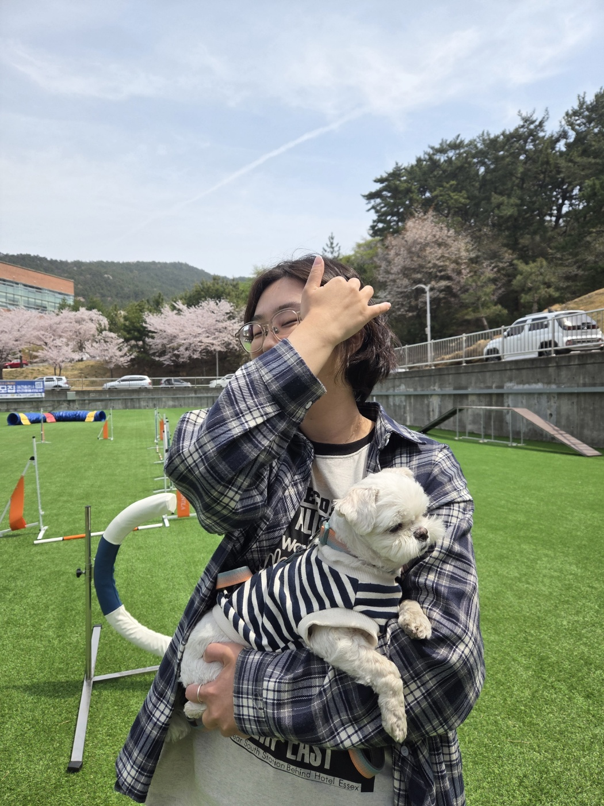

<!DOCTYPE html>
<html lang="ko">
<head>
<meta charset="UTF-8">
<meta name="viewport" content="width=device-width, initial-scale=1.0">
<title>JiHye Portfolio</title>
<link rel="stylesheet" href="style.css">
</head>
<body>

<!-- Hero -->
<section class="hero">
  

       <!-- 오른쪽 위 → 왼쪽 아래 -->

  

    <h1>Creative content & Markeing Design </h1>
    <h2>ChoiJiHye | Marketing Design Portfolio</h2>
  

 
  

    <!-- 왼쪽 아래 → 오른쪽 위 -->
</section>

<!-- About -->
<section class="about">
  

  

     <!-- About 상단 흐림 -->
  

  <!-- About 하단 흐림 -->
    
    

      <h2>ChoiJiHye</h2>
      

콘텐츠 제작과 디지털 마케팅에 관심을 가지고 다양한 프로젝트와 활동을 통해 콘텐츠 기획과 제작 경험을 쌓아왔습니다. 
협업과 실무 경험을 통해 아이디어를 실제 콘텐츠로 구현하는 과정에 흥미를 느끼고 있으며, 
마케팅 콘텐츠 디자인과 디지털 콘텐츠 제작 역량을 지속적으로 발전시키고 있습니다.
      

      <ul>

        <li>캠페인 및 홍보 활동을 통해 다양한 콘텐츠 제작 경험을 쌓았습니다.</li>

        <li>팀 프로젝트와 협업을 통해 아이디어를 콘텐츠로 구현하는 경험을 했습니다.</li>

        <li>카드뉴스, 홍보 콘텐츠 등 다양한 형태의 디지털 콘텐츠 제작에 참여했습니다.</li>

        <li>콘텐츠 기획과 디자인 경험을 바탕으로 실무 역량을 꾸준히 발전시키고 있습니다.</li>

      </ul>

    
 
</section>

<!-- Bottom 섹션 -->
<section class="bottom" id="bottom">
  

  

    <h2 class="bottom-title">Explore More</h2>
    

      
      <a href="details/experience.html">Youngmind Campaign</a>
      <a href="details/projects.html">National Park ESG Project</a>
      <a href="details/activities.html">Baekyang Tutoring Program</a>
      <a href="details/contact.html">Overseas Supporters Activity</a>
    

  

</section>

  <!-- Hero 섹션 하단 흐림 -->

<!-- About 섹션 상단/하단 흐림 -->

<!-- Bottom 섹션 상단 흐림 -->

</section>

<!DOCTYPE html>
<html lang="ko">
<head>
<meta charset="UTF-8">
<meta name="viewport" content="width=device-width, initial-scale=1.0">
<title>
Youngmind Campaign | JiHye Portfolio</title>
<link rel="stylesheet" href="../style.css">
</head>
<body>

</head>
<body>

  

  <section class="detail-hero">
    

      <h1>Youngmind Campaign</h1>
    

<a href="../index.html#bottom" class="btn-main-floating">← 메인으로 돌아가기</a>
  </section>

<section class="detail-content">
  

    
동물 관련 경험을 적는 공간입니다.

    <ul>
      <li>병원 인턴 근무 경험</li>
      <li>애견 유치원 근무 경험</li>
      <li>학생회 활동 프로젝트</li>
    </ul>
  

</section>

<!-- 플로팅 버튼 -->
<a href="../index.html#bottom" class="btn-main-floating">← 메인으로 돌아가기</a>

  <button id="contactBtn" class="floating-btn">문의사항 남기기</button>

</body>
</html>

<!DOCTYPE html>
<html lang="ko">
<head>
<meta charset="UTF-8">
<meta name="viewport" content="width=device-width, initial-scale=1.0">
<title>National Park ESG Project | JiHye Portfolio</title>
<link rel="stylesheet" href="../style.css">
</head>
<body>

</head>
<body>
  

  <section class="detail-hero">
    

      <h1>National Park ESG Project</h1>
    

  </section>
<a href="../index.html#bottom" class="btn-main-floating">← 메인으로 돌아가기</a>
  <section class="detail-content">
    

    
참여했던 프로젝트 내용을 소개합니다.

    <ul>
      <li>국립공원 ESG 지원 활동 프로젝트</li>
      <li>학생회 반려동물 행사 프로젝트</li>
      <li>POSCO M-TECH 협업 프로젝트 영상 제작</li>
    </ul>
  

</section>
<!-- 플로팅 버튼 -->
<a href="../index.html#bottom" class="btn-main-floating">← 메인으로 돌아가기</a>

  <button id="contactBtn" class="floating-btn">문의사항 남기기</button>

</body>
</html>

<!DOCTYPE html>
<html lang="ko">
<head>
<meta charset="UTF-8">
<meta name="viewport" content="width=device-width, initial-scale=1.0">
<title>
Baekyang Tutoring Program| JiHye Portfolio</title>
<link rel="stylesheet" href="../style.css">
</head>
<body>

</head>
<body>
  

  <section class="detail-hero">
    

      <h1>Baekyang Tutoring Program</h1>
    

  </section>
<a href="../index.html#bottom" class="btn-main-floating">← 메인으로 돌아가기</a>

<section class="detail-content">
  

    
참여했던 다양한 활동과 봉사 경험을 적는 공간입니다.

    <ul>
      <li>학생회 활동</li>
      <li>National Park ESG 지원</li>
      <li>포스코 M-TECH 프로젝트 참여</li>
    </ul>
  

</section>
<!-- 플로팅 버튼 -->
<a href="../index.html#bottom" class="btn-main-floating">← 메인으로 돌아가기</a>

  <button id="contactBtn" class="floating-btn">문의사항 남기기</button>

</body>
</html>

</body>
</html>
